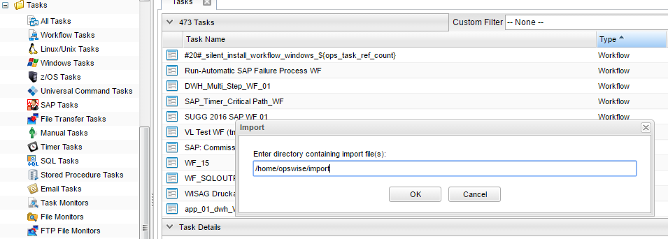
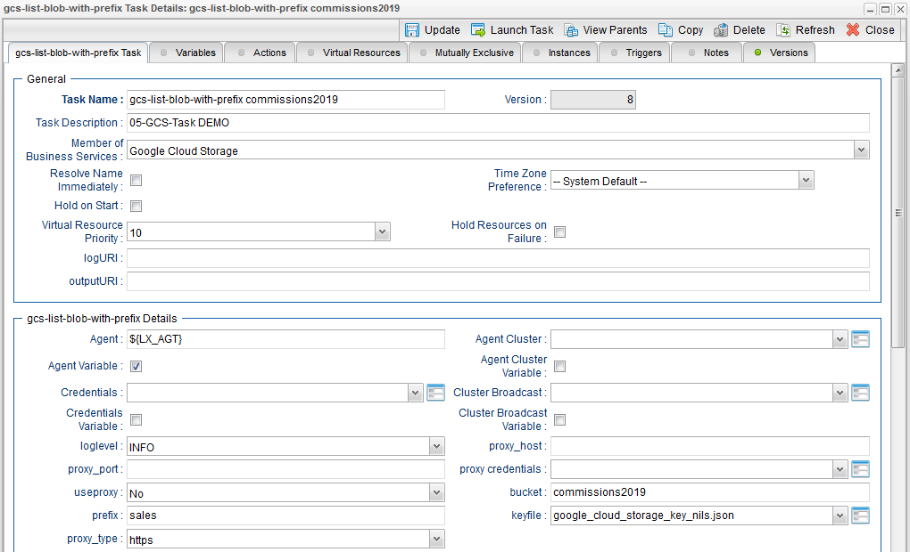

# ut-google-cloud-storage

Universal Automation Center support for scheduling Google Cloud Storage (GCS) file Transfers

# Abstract:  

The here described Universal Tasks allow to Transfer and retrieve files from Google Blob Storage in the Cloud. As a result, you can 
integrate any Google Blob Storage file transfer into you existing or new scheduling workflows, providing a true hybrid cloud (on-premise 
and cloud computer) file transfer solution.   

# 1. Disclaimer 

No support and no warranty are provided by Stonebranch GmbH for this document and the related Universal Task. The use of this document and 
the related Universal Task is on your own risk. 

Before using this task in a production system, please perform extensive testing. 

Stonebranch GmbH assumes no liability for damage caused by the performance of the Universal Tasks 

# 2. Scope  

This document provides a documentation how to install and use the Universal Tasks for Google Blob Storage File Transfers. If more Task 
will be created in the future this document will be updated accordingly.   

# 3. Introduction 

Storing data in the cloud becomes an integral part of most modern IT landscapes. With Universal Automation Center you can securely 
automate your AWS, Azure, Google or any other Cloud File Transfer and integrate them into your existing scheduling flows. 

The here described Series of Universal Tasks focuses on the Google Blob Storage file transfer. A similar solution as for Google is also 
available for Amazon S3 or Azure Blob storage.  

Some details about the universal tasks for Google Blob Storage: 

    - The Universal Tasks are calling the Microsoft Google “google-cloud-storage” API 

    - The python google-cloud-storage module is called by a Universal Agent running on a Linux Server or Windows Server – Note: This 
    document focuses on the Linux Version  

    - The Server Running the Universal Agent needs to have the Python 3.6.x option installed 

    - All Universal Task support encrypted connections via a Proxy Server 

    - You can configure all connection Parameters for the Proxy and Google via the Universal Task 

    - You can select different log-levels e.g. Info and debug 

The following Universal Task for Google Blob Storage have been implemented:  

Image 1:

# 4. Installation 

# 4.1 Software Requirements 

**Universal Task name:** ut-google-cloud-storage

**Related UAC XML Files for template and task:** Github repository 

**Software used:**  

For the set-up you need: 

    1. Python 3.6 – installed as part of the Universal Agent  

    2. For Python the following modules are required:  
        • Re, to support regular expression matching operations  
        • glob, to find Unix pathnames matching a specified pattern 
        • os, to support operating system dependent commands 
        • sys, for output re-direct processing 
        • datetime, date and time stamps for messages 
        • logging, to provide logging capabilities for debug, info etc. 
        • argparse, to allow testing of the Universal TPL. script on the command line 
        • google-cloud-storage, The Google libraries for Python to use Google services and manage Google resources 
        • fnmatch, module provides support for Unix shell-style wildcards 
        • from google.cloud import storage, exceptions 

Note: Only the module google-cloud-storage need to be added to python 3.6.x. e.g. using pip. 

      sudo /opt/universal/python3.6/bin/python3 -m pip install google-cloud-storage 
  
    3. Universal Controller 6.4.5.x or higher 

    4. Universal Agent 6.4.2.2 or higher installed on a Linux Server 

    5.A Google account to try it out 

    6.Google keyfile to authenticate with your google account
    
# 4.2 Installation Steps 

The following describes the installation steps: 

**1. Check the current Python Version** 

        python -V  (Note: Captial “V”) 

If your Version is Python 3.6 or later all is fine. If a no python or a lower Version has been installed upgrade your python Version or 
install the Universal Agent with the Python binding option (--python yes). This option will install python 3.6. along with your 
universal agent. 

    e.g. 
    sudo sh ./unvinst --network_provider oms --oms_servers 7878@192.168.88.12 --oms_port 7878 --oms_autostart no --ac_netname OPSAUTOCONF --opscli yes --python yes 

NOTE: the above install string does not work in case you did a user mode install 

Official Download link: https://www.python.org/downloads/ 

Note: To check the current Python Version type in a shell: python -V (capital V) 

**2. Add the google-cloud-storage modules to your python installation**

In a command shell run as root or sudo: 

    sudo /opt/universal/python3.6/bin/python3 -m pip install google-cloud-storage 
    
**3.Import each Google Blob Storage Universal Task including the Universal Template to your Controller**

Go to “All Tasks” and load via the Import functionality the Universal Task configuration into the Controller.  

Image 2:

Image 3:

# 5 Universal Task Configuration 

**1. Activate: Resolvable Credentials in Universal Automation Center:**

Image 4:

**2. Fill Out the Universal Task for each Google Blob Storage command, which you want to execute:**

In the example below the Google Create bucket Task was selected 

Image 5:

**Fill out or select the required Credentials for Google and optionally a Proxy Server**  

In the example below the Google_account credentials are shown: 

Image 6:

# 6 Universal Tasks for Google Blob Storage 

The following chapter describes the provided Google Blob Storage Universal Tasks. 

# 6.1 Create_Bucket
 
Image 7:

 
**Task Screenshot**
 
Image 8:

 
**Field Description**
 
Image 9:

 
# 6.2 Monitor-blob-in-bucket 
 
Image 10:

 
**Task Screenshot:** 
 
Image 11:

 
**Field Description:** 
 
Image 12:

 
# 6.3 Copy-file-to-bucket  
 
Image 13:

 
**Task Screenshot:** 
 
Image 14:

 
**Field Description:** 
 
Image 15:

 
# 6.4 List-blobs-in-bucket 
 
Image 16:

 
**Task Screenshot:** 
 
Image 17:

 
**Field Description:** 
 
Image 18:

 
# 6.5 Download-file-from-bucket 
  
Image 19:

 
**Task Screenshot:** 
 
Image 20:

 
**Field Description:** 
 
Image 21:

 
# 6.6 Delete-blob-from-bucket  
  
Image 22:

 
**Task Screenshot:** 
 
Image 23:

 
**Field Description:** 
 
Image 24:

 
# 6.7 Delete-empty-bucket 
 
Image 25:

 
**Task Screenshot:** 
 
Image 26:

 
**Field Description:** 
 
Image 27:

 
# 6.8 List-buckets 
 
Image 28:

 
**Task Screenshot:** 
 
Image 29:

 
**Field Description:** 
 
Image 30:

 
# 7. Test Cases 
 
The following basic test cases has been performed: 
 
Image 31:

# 8. Document References 

There are no document references. 

 
 
 
 
